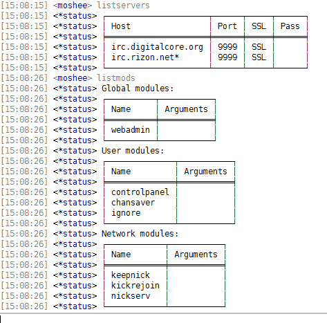

So I was hacking around and I thought it would be nice to use unicode box characters instead of the `+------+` in ZNC's text tables, so I tried to patch it. Failed the first two times, but what I have here seems to work alright.
The stuff in the file just replaces the contents of `bool CTable::GetLine(unsigned int uIdx, CString& sLine) const` in `Utils.cpp`. Simply patch and recompile.

Of course, it won't work right if the client doesn't support UTF-8, so don't try it on putty.

### Screenshot:

Much better than the old stuff.
